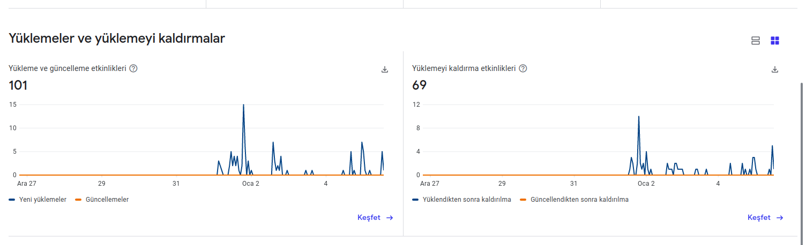

# CovidApp

Finansal Bilgi Teknolojileri dersi için yaptığımız react native projesidir.

## Hazırlayanlar:

- Yasin Doğru
- Mücahit Şahin
- Ersin Çakmak
- Muratcan Yusufoğlu

## Proje Tanımı

Projemizin amacı dünyayı etkisi altına alan pandemi sürecinde tüm dünya ülkelerinin günlük olarak toplam vaka, toplam ölüm ve toplam iyileşen sayılarını, her bir ülkenin her gün yüzleştiği vaka, ölüm, iyileşen sayıları ayrıca son 5 günü kapsayan toplam istatiki verilerini tek bir uygulamada toplamaktır. Bu sayede tüm dünya vatandaşlarının pandeminin genel seyri ve ülkeler özelinde güncel seyrinden haberdar olarak bilinçlenmesini ve bilgi sahibi olmasını hedeflemekteyiz.

## Raporlar

- <a href="./docs/ANALIZ_DOKUMANI.pdf" >Analiz Dökümanı</a>
- <a href="./docs/MIMARI_DIYAGRAM.pdf" >Mimari Diyagram</a>
- <a href="./docs/TEST_DOKUMANI.pdf" >Test Dökümanı</a>
- <a href="./docs/UX_TASARIM_DOKUMANI.pdf" >UX Tasarım Dökümanı</a>

Not: Uygulamamızda veritabanı olmadığından dolayı Veritabanı Diyagramı dökümanı tarafımızca hazırlanmamıştır.

## Uygulamamızın Google Play'deki genel yükleme analizi aşağıdaki gibidir.

